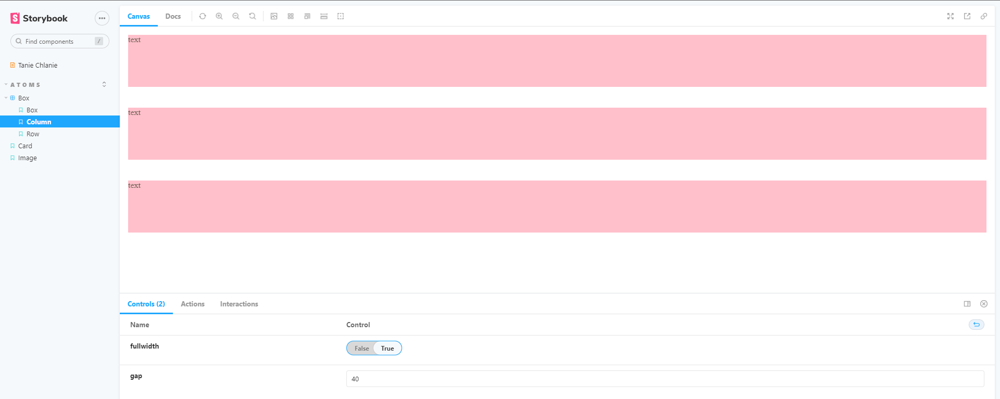

# Storybook

Narzędzie / Biblioteka do udokumentowania komponentów aplikacji. Pozwala zaprezentować użytkownikom,
grafiką i innym członkom zespołu dany komponent. Prezentuje element bez otoczki aplikacji czysty
element.

Budowanie własnego design systemu pozwala nam w łatwiejszy sposób tworzyć strony dzięki kompozycji.

<a link='https://reactjs.org/docs/composition-vs-inheritance.html' >Kompozycja a dziedziczenie</a>

<a link='https://felixgerschau.com/react-component-composition/' > React Component Composition
Explained</a>

---

## Jak tworzymy stories

każdy komponent umieszczony w katalogu components musi mieć swój plik .stories byśmy mogli go
zaprezentować bez życia reszty aplikacji.

```
Plik nazywamy jak komponent z dodatkiem .stories.tsx -> XXXXXX.stories.tsx
```

<br> </br>

### Konfiguracja

Musimy w pliku .stories zdefiniować podstawowe ustawienia. Potrzebne są dla storybooka by mógł
poprawnie wygenerować stronę z komponentem.

- Jaki komponent będzie prezentować
- W Jakiej sekcji ma sie znaleźć

```js
export default {
  title: "Atoms/Box",
  component: Column
} as ComponentMeta<typeof Column>;
```

Następnie by zaprezentować jakiś wariant komponentu musiby stworzyć template naszego .stories

```js
const ColumnTemplate: ComponentStory<typeof Column> = (args) => <Column {...args}>...</Column>;
```

Po stworzeniu templatki możemy pokazać podstawowy oraz dodatkowe warianty danego komponentu.
Prezentując odzielnie warianty jesteśmy wstanie przedstawić różne działania komponentu zależnie od
podanych parametrów. Jesteśmy wstanie też stworzyć jeden widok komponentu z możliwością
konfigurowania paramterów z poziomu UI storybooka.

Przykład tworzenia podstawowego widoku komponentu z góry wskazanymi parametrami

```js
export const ColumnDefault = ColumnTemplate.bind({});
ColumnDefault.storyName = "Column";
ColumnDefault.args = {
  fullwidth: true,
  gap: 40
};
```

<br> </br>

##### Efekt końcowy


